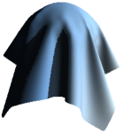

# WebGL Game engine
A small WebGL based game engine using vanilla javascript and the glMatrix library for vector and matrix math.

This project is a small hobby project for educational purposes. It is also my first time writing anything more than a couple of lines of javascript, so excuse the less than optimal code :)

# Features
 - Directional shadow mapping
 - Lambertian Shading
 - Simple .OBJ loading
 - Scene loading from custom JSON files
 - Axis-aligned bounding box based physics
 - Settings panel

# Structure
## File structure
```
.
├── js
|   ├── main.js           # starts the game engine and contains js for handling the frontend such as the settings panel
|   ├── GameEngine.js     # contains main game loop, the render- and physicsengine, handles loading of assets and other game logic
|   ├── RenderEngine.js   # handles the rendering of the scene to the html canvas using WebGL
|   ├── PhysicsEngine.js  # handles physics such as dynamics and collision
|   ├── ShaderSources.js  # contains the GLSL source code for the WebGL shaders
│   └── other js files    # self explanatory
│     
├── imgs          # textures
├── objs          # meshes in OBJ format
├── scenes        # scenes files in JSON format
└── test.html     # the HTML file containing the canvas and settings panel
```
## Scene structure
The scene JSON files have the following general structure:
```
.
├── "assets"
│     ├── "meshes"      # contains ids and paths to meshes
│     ├── "textures"    # contains ids, types and paths to textures
│     ├── "materials"   # combines references to multiple textures
│     └── "models"      # combines references to meshes and materials as well as contains render settings
│
└── "worldObjects"      # contains information such as type of object, model, position, rotation, AABB's etc


```

# Demo
A short gif demonstrating some of the features.


**Note:** when running the code yourself, you need to run a simple webserver or you will get a CORS error.

# To do/next steps
1. Fix incode todo's relating to readability.
2. Make textures repeating (or add option to, maybe add scale parameter)
3. Implement normal mapping
      - Load normal textures
      - Calculate tangents in model-loader
      - Create default (no normals) normal map and give material a normal setting
      - Implement the normals in shader
4. Implement specular and ambient components of phong-shading
5. Implement specular mapping
6. Add support for non-trangulated OBJ files

# Known issues/bugs
- The AABB's don't update when rotating an object
- The UV mapping doesn't seem to completely work yet (the top and bottom faces of a cube arne't mapped correctly)